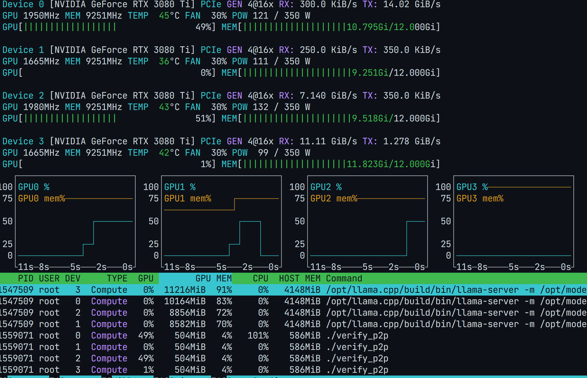
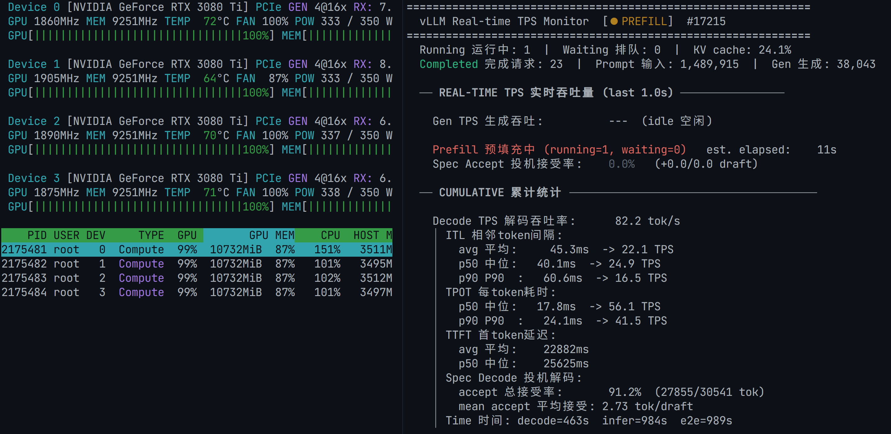

# NVIDIA open-gpu-kernel-modules（570.148.08 + 消费级 P2P 补丁）

本仓库在 NVIDIA 官方开源驱动基础上，整合了 tinygrad 的 P2P 补丁与对
Ampere 消费级 GPU（GA102 / RTX 3080 Ti）的 PCIe BAR1 P2P 支持，
让 4090 / 5090 / 3080 Ti 等消费卡也能使用 GPU Direct P2P。

## 项目来源

本仓库是一条层层叠加的补丁链，最终目的是把 NVIDIA 数据中心 GPU 才默认开启的
PCIe P2P 能力下放到消费级显卡：

| 层级 | 来源 | 作用 |
|------|------|------|
| 1. 上游 | [NVIDIA/open-gpu-kernel-modules](https://github.com/NVIDIA/open-gpu-kernel-modules) `570.148.08` tag | NVIDIA 官方开源内核模块，P2P 仅对数据中心 GPU 默认启用 |
| 2. Fork | [tinygrad/open-gpu-kernel-modules](https://github.com/tinygrad/open-gpu-kernel-modules) `570.148.08-p2p` 分支 | tinygrad 的 P2P patch：强制 `forceP2PType = BAR1P2P`，HAL 函数指针绑定到 GH100（Hopper）实现，使 4090/5090 可用 P2P |
| 3. 本仓库 | 在 tinygrad `570.148.08-p2p` 基础上的本地改动 | 增加 Ampere GA102 / RTX 3080 Ti 支持（见下文「RTX 3080 Ti 补丁」） |

> 即：本仓库 = NVIDIA 官方 570.148.08 + tinygrad P2P patch + 3080 Ti BAR1 适配。
> 远程 `origin` 指向 tinygrad 的 `570.148.08-p2p` 分支，本地的 3080 Ti 改动
> 尚未提交（见 `git status`）。

## tinygrad P2P patch（4090 / 5090）

tinygrad 的补丁已经：
- 把 `forceP2PType` 默认设置为 `BAR1P2P`
- 把所有 HAL 函数指针绑定到 GH100（Hopper）实现

这样 4090 / 5090 就能直接使用 P2P，无需额外修改。详细说明见
<https://github.com/tinygrad/open-gpu-kernel-modules>。

---

## RTX 3080 Ti（GA102）PCIe P2P 补丁

在 tinygrad 的 `570.148.08-p2p` 分支基础上，增加了对 Ampere 消费级 GPU
（GA102 / RTX 3080 Ti）的 PCIe BAR1 P2P 支持。

### 背景

tinygrad 的 P2P patch 已经把 `forceP2PType` 默认设置为 `BAR1P2P`，并把
所有 HAL 函数指针绑定到 GH100（Hopper）实现。3080 Ti 无法工作的根本原因
是 **BAR1 大小检查**：

| 问题 | 原因 |
|------|------|
| `staticBar1ForceType = ONLY_GPU` | 走到最后的 BAR1 大小检查路径 |
| 3080 Ti BAR1 默认 256 MB | 远小于 12 GB VRAM，检查失败 |
| `NV_ERR_NOT_SUPPORTED` 返回 | Static BAR1 不被启用，P2P 建立失败 |

### 修改内容（2 个文件）

#### `src/nvidia/src/kernel/gpu/bus/kern_bus.c`

把默认 `staticBar1ForceType` 从 `ONLY_GPU` 改为 `ENABLE`，让驱动
进入专门为消费卡设计的 force-enable 路径，跳过 GPU 型号白名单逻辑，理论上消费卡都能用。

#### `src/nvidia/src/kernel/gpu/bus/arch/turing/kern_bus_tu102.c`

移除两处 BAR1 大小门控检查：

1. `ENABLE` 模式下：去掉 `bar1VASizeAligned < bar1MapSize` 检查
2. `ONLY_GPU` 尾部：去掉 `bar1VASize < doorbellAndMmioPrivSize + fbSizeAligned` 检查

`kbusEnableStaticBar1Mapping_TU102` 本身不修改——它通过
`kbusMapFbApertureSingle` 安全地把 mapping 大小限制在实际可用的 BAR1
窗口内，不会越界。

### 硬件前提

1. **ReBAR（Resizable BAR）**：强烈建议在 BIOS 中开启，让 BAR1 从 256 MB
   扩展到 12 GB，否则 P2P 窗口只有 256 MB，访问范围受限。
2. **PCIe 拓扑**：两块卡必须共享同一个 PCIe Root Complex。
3. **平台**：AMD Threadripper/EPYC 通常完整支持 P2P；Intel 消费平台
   （Z490/Z590/Z690 等）可能有 PCIe P2P 限制，需要测试。
4. **IOMMU**：Linux 下建议 `iommu=pt` 或关闭 IOMMU，避免 DMA remap 干扰。

---

## 编译方法

操作系统： Ubuntu 24.04 LTS Server


```bash
# 1. 安装匹配版本的用户态驱动（仅内核模块，不替换用户态）
sudo sh NVIDIA-Linux-x86_64-570.148.08.run --no-kernel-modules

# 或通过download-deb.sh 下载deb安装包，说实话我没找到runfile
sudo apt install dkms

# 2. 编译内核模块
cd /path/to/open-gpu-kernel-modules
make modules -j$(nproc)

# 3. 卸载旧模块并安装新模块
sudo rmmod nvidia_uvm nvidia_drm nvidia_modeset nvidia
sudo make modules_install -j$(nproc)
sudo modprobe nvidia

# 4. 在grub中添加内核启动参数 如下
cat /etc/default/grub |grep LINUX_DEFAULT
GRUB_CMDLINE_LINUX_DEFAULT="quiet splash pcie_aspm=off pcie_acs_override=downstream iommu=pt"

```

## 验证

```bash
# 确认 static BAR1 已启用
dmesg | grep -i "static bar1"

# 确认 P2P 映射已建立（tinygrad 测试）
python3 -c "
import ctypes
nv = ctypes.CDLL('libnvidia-ml.so.1')
# 或者用 tinygrad 的 GPU P2P 测试
"
```

## 一些测试截图






## 风险说明

- 这是**实验性修改**，不保证稳定性
- 如果 BAR1 mapping 失败（FB 地址空间超出 BAR1 窗口），P2P 访问可能静默返回
  错误数据。开启 ReBAR 可以消除这个风险
- 不影响无 P2P 的正常 GPU 使用

## Patch 文件

3080 Ti 的改动以 git patch 形式提供：
`0001-add-ampere-ga10x-pcie-p2p-support.patch`

## 许可证

继承自上游 NVIDIA open-gpu-kernel-modules：单个文件为 MIT 许可，
链接成 Linux 内核模块时为 MIT/GPLv2 双许可。详见 [COPYING](COPYING)。
